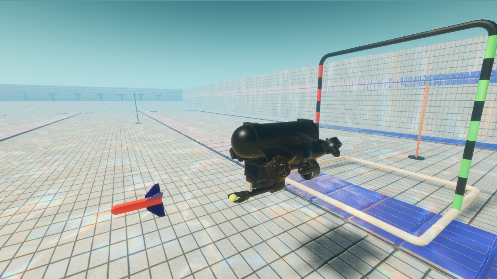

# UnitySim for underwater robotics

## Introduction

UnitySim is a simulation environment for underwater robotics, created to test out autonomous algorithms before they are deployed on real vehicles. It is developed by [Mecatron](https://mecatron.sg/) to simulate AUV competitions such as the Singapore AUV Challenge and RoboSub. Support is also added for manual control of the vehicle by keyboard and external controllers (in this case is F370 gamepad).

## Features

UnitySim supports the majority of common underwater sensors:
- IMU
- Depth sensor
- Camera
- Sonar
- DVL
- Pose (for ground truth)  

### What's new?

UnitySim also has actuators which are specifically designed for Mecatron's AUV, for SAUVC and RoboSub competitions:
- 2-DOF robotic arm with gripper
- Torpedo launcher
- Marker dropper

Vehicle control can be done with:
- Keyboard
- F370 gamepad
- ROS

Thanks to the packages `ROS-TCP-Connector` and `ROS-TCP-Endpoint` developed by Unity Technologies, UnitySim can communicate with ROS. This allows for the publishing of sensor data to ROS and the receiving of control commands from ROS.

As Unity and ROS communicate over TCP-IP, the simulation can be run on a separate machine from the ROS system. This allows for the simulation to be run on a powerful machine while the ROS system can be run on a low-power machine, as long as they are connected to the same local network.

## Tutorials

### - [Tutorial 0: Installation](docs/installation.md)
### - [Tutorial 1: Overview of Unity scene, available sensors and ROS](docs/sensors.md)
### - [Tutorial 2: Interacting with the simulation - vehicle control and actuators](docs/control.md)

## Future work

In the foreseeable future, the following features will be added:
- Create a gripper that can realistically open and close (as of now picking up of objects is done through FixedJoint)
- Add more props for RoboSub. As of now, the scene is designed for SAUVC.

Long term work:
- Replace Rigidbody with ArticulationBody for better physics simulation
- Make the scene photorealistic with HDRI sky and other settings

## Acknowledgements

**Author**: [Tien Luc Vu](https://www.linkedin.com/in/luc-vu-tien-601138131/) ([Mecatron Underwater Robotics](https://mecatron.sg/), NTUsg)

The project has already installed the following Unity packages and would like to thank the authors of these packages:

- Unity package used for simulating water graphics: [Crest Water 4 HDRP](https://crest.readthedocs.io/en/stable/?rp=hdrp).

- Unity package used for water physics simulation (even though the project does not use much of it): [Dynamic Water Physics 2](https://www.dynamicwaterphysics.com/doku.php/index)

- [ROS-TCP-Connector](https://github.com/Unity-Technologies/ROS-TCP-Connector.git)

- [URDF-Importer](https://github.com/Unity-Technologies/URDF-Importer)

> Note: `Crest Water 4 HDRP` and `Dynamic Water Physics 2` are charged assets in the Unity Asset Store. The project has purchased these assets and used them in the simulation. As such, you are not allowed to circulate this project without permission.

Many of the scripts of this project are inspired by and modified from these two packages. The author would like to thank the authors of these packages making them open-source.
- [MARUSSimulator](https://github.com/MARUSimulator/marus-example). The project is originally a clone of MARUSimulator, but it has been heavily modified to suit the needs of Mecatron.
- [Robotics-Nav2-SLAM-Example](https://github.com/Unity-Technologies/Robotics-Nav2-SLAM-Example/tree/main). Scripts such as [Clock](docs/sensors.md#clock) and [ROS Clock Publisher](docs/sensors.md#rosclockpublisher) are borrowed from this package.

On the local ROS side, the following package is used:
- [ROS-TCP-Endpoint](https://github.com/Unity-Technologies/ROS-TCP-Endpoint)

