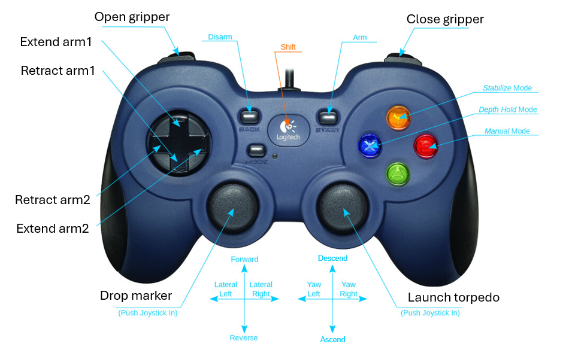
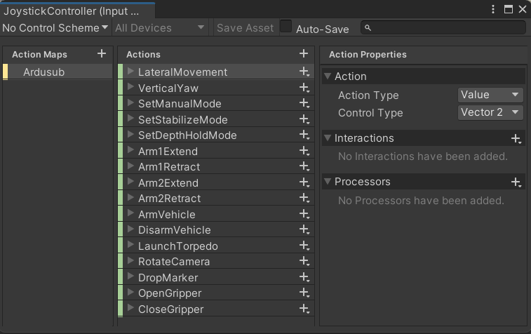
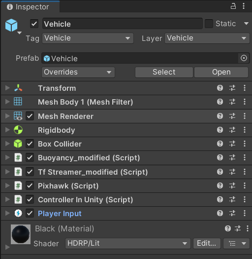
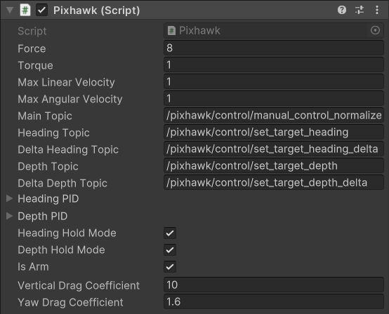
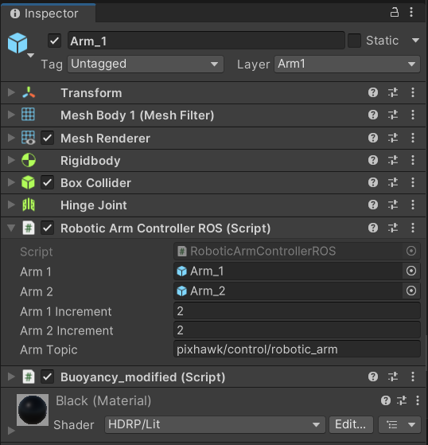
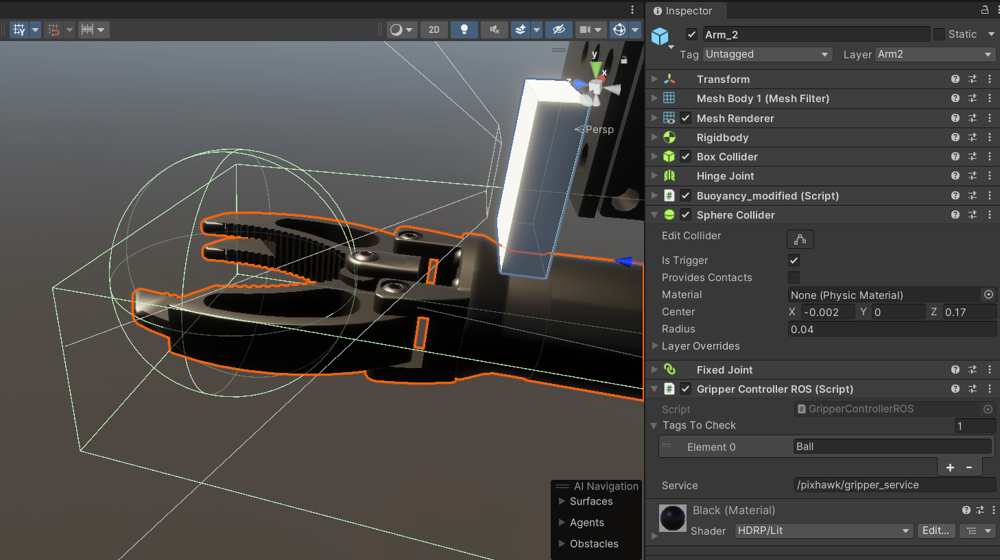
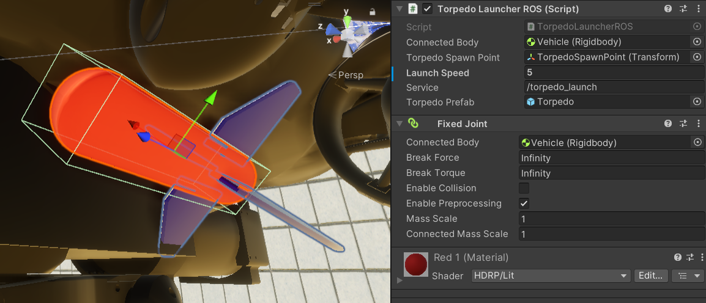
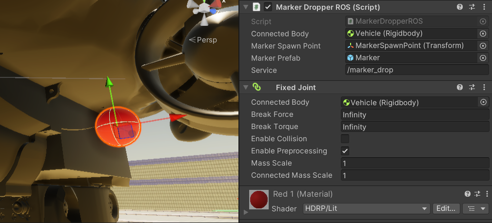

# Tutorial 2: Interacting with the simulation - vehicle control and actuators

In this tutorial, we will learn how to interact with the simulation. We will learn how to control the vehicle using keyboard, gamepad and ROS. We will also learn how to control the actuators of the vehicle.

For an explanation of the scene and the available sensors, refer to [Tutorial 1](sensors.md).

**Table of Contents**

- [Overview](#overview)
    - [Control from ROS](#control-from-ros)
    - [Control from Unity](#control-from-unity)
- [Specifics](#specifics)
    - [Vehicle Control](#vehicle-control)
    - [Robotic arm](#robotic-arm)
    - [Torpedo Launcher](#torpedo-launcher)
    - [Marker Dropper](#marker-dropper)

---

## Overview

This project has been designed for development of both autonomous and remotely controlled systems. On the autonomous side, the vehicle and all of the attached actuators have either ROS topics or services that can be used to control them. On the remote control side, the vehicle can be controlled inside Unity using a keyboard or a gamepad.

### Control from ROS

In each game object, the component responsible for ROS communication will have a `ROS` suffix such as `TorpedoLauncherROS` or `RoboticArmControllerROS`. Each game object usually has their own ROS script. You can modify the name of the topics or services from the Unity editor.

These scripts also use custom ROS msg/srv for communication. As such, you need to pull/clone the [common_msg_srv](https://github.com/NTU-Mecatron/common_msg_srv) *into your ROS workspace*. This package has already been added to this Unity project under `Assets/common_msg_srv`. 

To create more custom msg/srv, you can create new `.msg` and `.srv` files in the `common_msg_srv` package and Unity will automatically build the messages in C#. For more information, refer to [Unity-MessageGeneration](https://github.com/Unity-Technologies/ROS-TCP-Connector/blob/main/MessageGeneration.md). 

> Tip: You do not need to edit the `CMakeLists.txt` file in the `common_msg_srv` package inside Unity as it is only looking for `package.xml`. However, in your own ROS workspace, you will need to edit `CMakelists.txt` inside the `common_msg_srv` package if you want to create more custom msg/srv. Refer to [ROS-CreateMsgAndSrv](http://wiki.ros.org/ROS/Tutorials/CreatingMsgAndSrv) for more information.

> A note on integration with BehaviorTree.CPP: Unity so far does not support ROS action and action servers. Typically, you will need to use services to trigger an action, or publish to a topic (for example to move the robotic arm). However, as you will see, setting heading and depth have extra topics which return "true" upon completion of the action, simulating the behavior of an action server.

### Control from Unity

On the other hand, the only script responsible for Unity control of the vehicle and all of the actuators from keyboard and gamepad is the `ControllerInUnity` component, which is already attached to the vehicle. The settings for the keyboard and gamepad can be found in `Assets/Scripts/JoystickController.inputactions` and can be changed to suit your preference. This has no effect on the ROS control.

> Note: For now, the `Shift` button has no function.

On the keyboard:

    WASD: move the vehicle forward/backward and left/right.
    QEGH: move the vehicle up/down and yaw left/right.
    5846 on numpad: move arm_1 and arm_2.
    79 on numpad: close and open the gripper.
    T: launch torpedo.
    M: drop marker.
    IJKL: move the internal camera (function not available for gamepad).

To add new control functionalities, please watch through this [Youtube tutorial](https://www.youtube.com/watch?v=5tOOstXaIKE&t=505s).

## Specifics

### Vehicle Control

The vehicle prefab the following components responsible for its control:

> **Warning**: the values in `Rigidbody`, `Buoyancy_modified` and `Pixhawk` have already been set to simulate, as much as possible, the behavior of a real underwater vehicle. If you want to speed up the simulation, you can change `Edit` -> `Project Settings` -> `Time` -> `Time Scale` to a larger value. A value below 10 still retain simulation accuracy.

#### Pixhawk

Required for control from ROS and simulating the various functionalities of the [ArduSub firmware](https://www.ardusub.com/). It is also a required component for `ControllerInUnity` to work.

- `Force` and `Torque`: adjust to change vehicle acceleration. However, the vehicle will not move faster than the limits set by `Max Linear Velocity` (m/s) and `Max Angular Velocity` (rad/s).

- `Main topic` (`std_msgs/Float32MultiArray.msg`)

To control the vehicle, publish messages to this topic in the format of (x, y, z, r), where x, y, z, and r represent the thruster levels between -1 and 1. 

    Positive x values indicate forward movement.
    Positive y values indicate rightward movement.
    Positive z values indicate upward movement.
    Positive r values indicate right turns.

Ensure that the values you publish are within the specified range to control the vehicle accurately.

- `Heading Topic` and `Heading Topic Delta` (`std_msgs/Float32`): send a simple float data to set the absolute heading or change in heading of the vehicle. Unit is in degrees. When the vehicle has reached the desired heading, it will publish a `std_msgs/Bool(true)` message to either (`Heading Topic`+"/result") or (`Heading Topic Delta`+"/result").

- `Depth Topic` and `Depth Topic Delta` (`std_msgs/Float32`): send a simple float data to set the absolute depth or change in depth of the vehicle. Unit is in meters; negative values indicate going down. When the vehicle has reached the desired depth, it will publish a `std_msgs/Bool(true)` message to either (`Depth Topic`+"/result") or (`Depth Topic Delta`+"/result").

- `Heading PID` and `Depth PID`: PID controllers for heading and depth control simulating heading hold mode and depth hold mode. You can adjust the PID values to change the control behavior.

- `Heading Hold Mode` and `Depth Hold Mode`: enable to simulate heading hold mode and depth hold mode, simulating [ArduSub's manual/stabilize/depth hold mode](https://www.ardusub.com/reference/ardusub/features-while-in-operation.html). The vehicle will try to maintain the heading and depth set by the PID controllers.  

Details of each mode:

    Manual mode: false for both `Heading Hold Mode` and `Depth Hold Mode`.
    Stabilize mode: true for `Heading Hold Mode` and false for `Depth Hold Mode`.
    Depth hold mode: true for `Heading Hold Mode` and true for `Depth Hold Mode`.

- `Vertical Drag Coefficient` and `Yaw Drag Coefficient`: adjust to change how fast the vehicle settles at certain depth or heading when no control input is given. Higher values mean faster settling.

#### Controller In Unity

Responsible for controlling the vehicle *from Unity using keyboard and gamepad*. It is also responsible for calling the functions of various actuators such as `RoboticArmControllerROS`, `TorpedoLauncherROS`, `MarkerDropperROS` and `GripperControllerROS`.

#### Player Input 

Not a scripted component but required for assigning control functions to the vehicle. It is also required for `ControllerInUnity` to work.

### Robotic arm

#### Hinge Joints

Hinge joints connect `Arm_2` with `Arm_1`, and `Arm_1` with the `vehicle`. They behave like springs which try to bring the position of the arm to position specified by your scripts. You can adjust the properties under `Spring` to control how the arm behaves.  

#### Robotic Arm Controller ROS

This component is attached to `Arm_1` (the upper arm) and is responsible for controlling the entire robotic arm from ROS.

- `Arm 1 Increment` and `Arm 2 Increment`: useful for controlling the robotic arm in small increments from inside Unity. Increase the values to move the arm faster.

- `Arm Topic` (`std_msgs/Float32MultiArray.msg`): publish messages to this topic in the format of (theta1, theta2), where theta1 and theta2 represent the angles of the two joints of the robotic arm in degrees. 0 for for fully retracted and 180 for fully extended.

#### Gripper Controller ROS

As of now, `Arm_2` is a continuous mesh and does not allow the gripper part to move as in real life. As such, here is the temporary solution to simulate the gripper:

- `Open Gripper` will break the FixedJoint between `Arm_2` and the object inside the gripper. The object will no longer be a child of `Arm_2`.

- Check if there is any object with the tag under `Tags To Check` inside the `Sphere Collider`. If there is, it will log a message to the console. **Thus, you can only pick up the object if it is within this sphere.**

- `Close Gripper` will create a FixedJoint between `Arm_2` with the object inside the gripper. The object will move with the gripper and become a child of `Arm_2`.

- However, if any point the object is not within the `Sphere Collider` during the approach process, the object will not be picked up.

If you want to grab other objects, you need to assign them a tag and add this tag to `Tags To Check`.

### Torpedo Launcher

Most of the components here should be self-explanatory. You can call the service of type `common_msg_srv/Trigger.srv` (send a boolean value) to launch the torpedo. The `Torpedo Prefab` should be assigned from the `Torpedo` game object in the scene, not from Assets.

### Marker Dropper

Entirely similar to the `Torpedo Launcher`.

    
