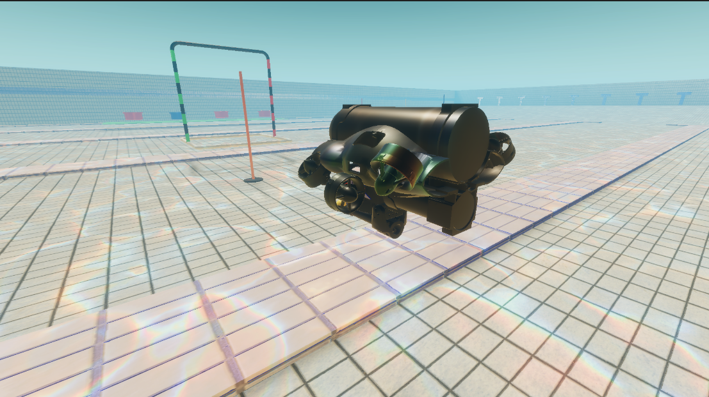

## Install the Unity Editor

After installing Unity Hub, you can install the Unity Editor. You should download versions 2022 and above.

## Cloning the Project

Prerequisite: you need to [install Git-LFS](https://docs.github.com/en/repositories/working-with-files/managing-large-files/installing-git-large-file-storage)

You can clone the project with the following command:

```GIT_CLONE_PROTECTION_ACTIVE=false git clone https://github.com/NTU-Mecatron/UnitySim.git```

However, for continuous development, you are recommended to pull the project from the main branch. 

```bash
# Move to a directory where you want to pull the project. This should not be inside your ROS workspace.
cd /your_path

mkdir UnitySim && cd UnitySim
git init
git remote add origin https://github.com/NTU-Mecatron/UnitySim.git
git pull origin main
```

> Note: Avoid downloading as zip as it might lead to errors.

## Opening the Project

In the Unity Hub, click on the `Add` button and navigate to the project folder. Select the folder and click on the `Open` button. The project should now appear in the Unity Hub.

After opening the project, navigate to the `Assets/Scenes` folder. As of now there is only one scene in the project, `SAUVC Scene`. Double click on the scene to open it.



## Configuring the external Script Editor

You can either use Microsoft Visual Studio or Visual Studio Code as the script editor. Common steps for setting up:  

1. Window -> Package Manager. In the top left corner, select `Unity Registry` from the Packages drop-down menu. Install both the `Visual Studio Code Editor` and `Visual Studio Editor` packages.

2. Edit -> Preferences -> External Tools. Set the External Script Editor to the desired editor.

## Configuring ROS settings in Unity
Refer to [ROS-Components](explanation.md#ros-components) for setting up the ROS connection in Unity.    

## Setup ROS workspace

First, we need to install the `ROS-TCP-Endpoint` package. This package is used to communicate between Unity and ROS. 

```bash
cd ~/catkin_ws/src

# clone the Roscpp branch which is supposedly the more performant version for camera streaming
# you can also clone from the main branch which is in Python
git clone -b Roscpp https://github.com/Unity-Technologies/ROS-TCP-Endpoint.git

cd ..

catkin_make
```

Afterwards, you need to make a small modification to the launch file as explained in the [The-ROS-Workspace](explanation.md#the-ros-workspace) section.

## Running the project
- Run the launch file in the terminal. This must be done before playing the Unity scene. Make sure that you have set the param `/use_sim_time` to `true` in the launch file.

```bash
roslaunch ros_tcp_endpoint endpoint.launch
```

- Play the Unity scene. The scene should now be connected to ROS.

- Refer to [Tutorial 1](sensors.md) to have an overview of the scene.

- Refer to [Tutorial 2](actuators.md#control-from-unity) to start controlling the vehicle and actuators.


