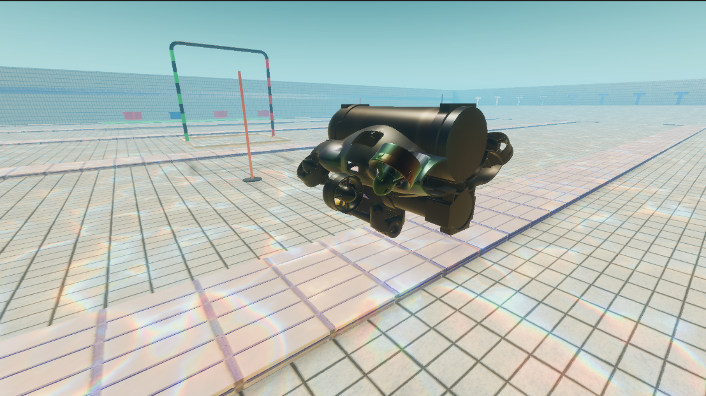
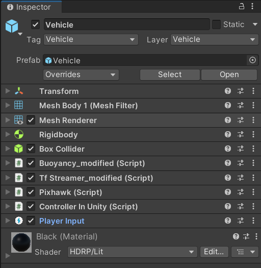
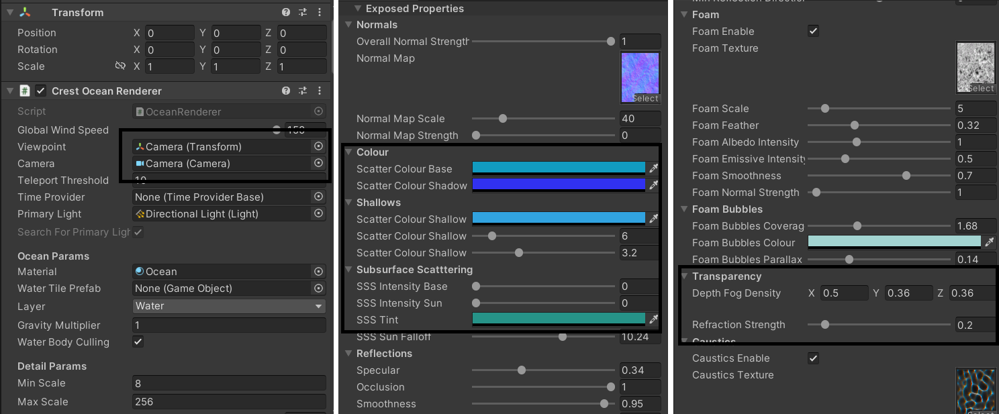
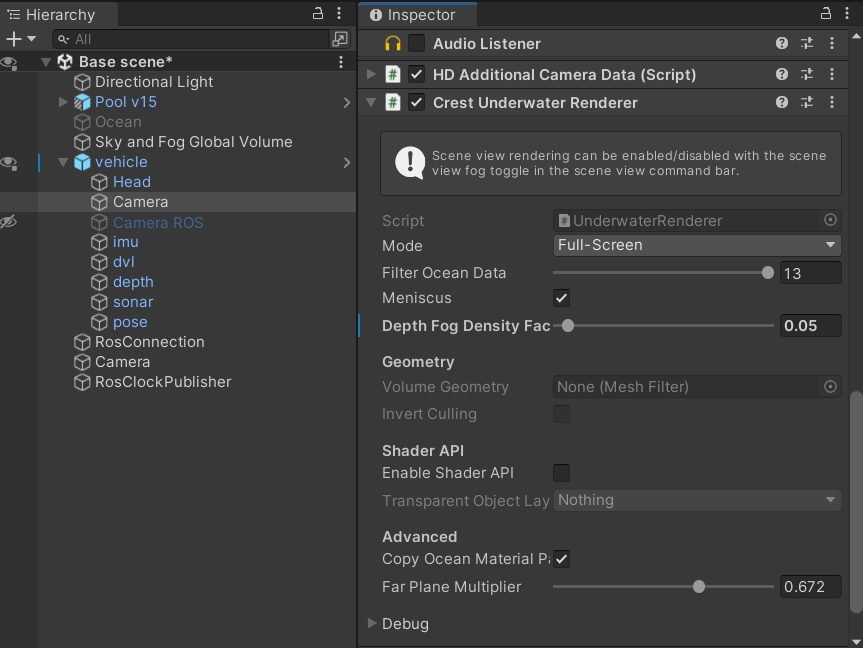
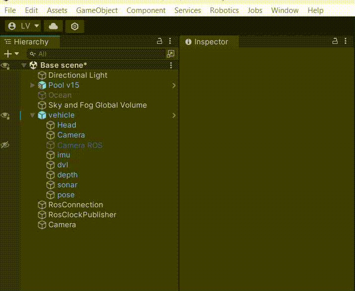
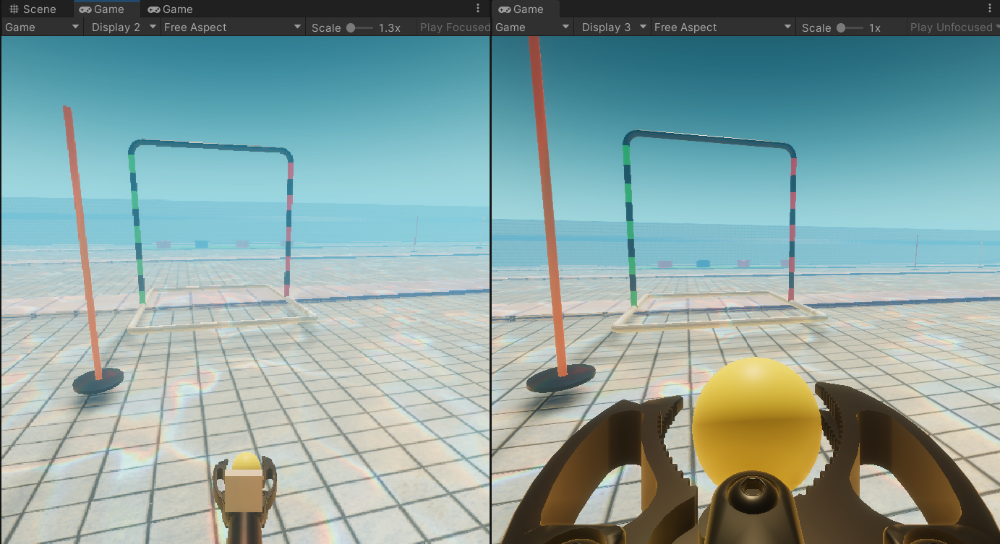
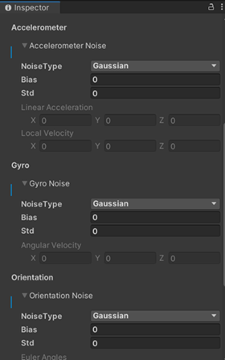
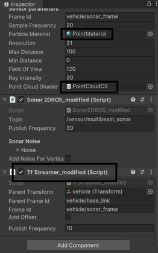
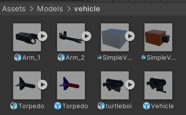
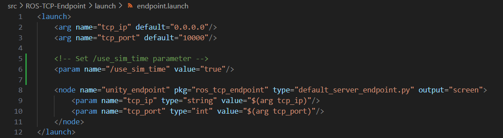

# Tutorial 1: Overview of Unity scene, available sensors and ROS

This page contains brief explanations for the various components in the Unity and how to receive data from them in ROS. For instructions on how to control the vehicle and actuators, refer to [Tutorial 2](actuators.md).

**Table of Contents**
- [The Unity Scene](#the-unity-scene)
    - [Vehicle](#vehicle)
    - [Water Appearance](#water-appearance)
    - [Underwater Renderer](#underwater-renderer)
    - [ROS Components](#ros-components)
- [Multi-camera system](#multi-camera-system)
    - [Vehicle cameras](#vehicle-cameras)
    - [3rd person follower camera](#3rd-person-follower-camera)
- [Sensors](#sensors)
    - [Clock](#clock)
    - [ROSClockPublisher](#rosclockpublisher)
    - [TfStreamer_modified](#tfstreamer_modified)
    - [CameraROS_modified](#cameraros_modified)
    - [ImuROS_modified](#imuros_modified)
    - [DvlROS_modified](#dvlros_modified)
    - [DepthROS_modified](#depthros_modified)
    - [Sonar2DROS_modified](#sonar2dros_modified)
    - [PoseROS_modified](#poseros_modified)
- [Prefabs](#prefabs)   
- [The ROS Workspace](#the-ros-workspace)

---

Everything we've created to enable this particular Project lives inside the Assets folder, which you can locate in the Project Browser panel.

## The Unity Scene
We have made one example scene called `Base Scene`. You can create your own scene, but it is recommended that you understand this scene first.  



### Vehicle


There is already a vehicle prefab under Assets/Models/Vehicle. You can drag and drop it into the scene. The vehicle has a few components attached to it.

The vehicle requires a few components:
- `Transform`. The scale must be set to (1, 1, 1) in order to work correctly.
- `RigidBody`. You can change the mass and drag values according to your needs. Modifying the mass will affect speed, acceleration, rotational motion and buoyancy. 
- `Box Collider`. This is used for collision detection. 
- `Buoyancy_modified`. This is used to simulate simple buoyancy. You can change the `Water Level` and `Total Buoyancy` values to adjust the buoyancy. Changing `Water Level` will decide where the vehicle will stop floating up further. `Total Buoyancy` is the total upward *buoyant mass*; it can be set slightly higher than the `Rigidbody.mass` to make the vehicle slightly positively buoyant, or much lesser to make it sink.
- `TfStreamer_modified` script to publish the transform data to ROS `/tf` topic. It is responsible for setting up the transform tree from `map` to `vehicle/base_link`, which will then be used to connect to the other sensors.

For controlling the vehicle, you will need these components: `Pixhawk` (compulsory and pre-requisite), `VehicleController` (optional, for manual control from keyboard and external gamepad), and `PlayerInput` (supporting script for `VehicleController`). Refer to [Tutorial 2](actuators.md) for details.

This project also provides the following scripts for sensors:
- [CameraROS_modified](#cameraros_modified)
- [ImuROS_modified](#imuros_modified)
- [DvlROS_modified](#dvlros_modified)
- [DepthROS_modified](#depthros_modified)
- [Sonar2DROS_modified](#sonar2dros_modified)
- [PoseROS_modified](#poseros_modified)

### Water Appearance


The ocean object has the script `Crest Ocean Renderer` attached to it. You can change the parameters of the ocean as shown in the image. The `Viewpoint` and `Camera` must also be set correctly; in a sense, if a scene has multiple cameras, only one camera will have really good water effects.

> Note: If you are not dealing with computer vision tasks which require good visuals, you should disable the `Crest Ocean Renderer` script to save computational cost of the simulation.

### Underwater Renderer


The `Camera` object should have the `Crest Underwater Renderer` script attached to it to render underwater effects. You can change the `Depth Fog Density Factor` to achieve the desired level of foggyness.

### ROS Components


There are three essential ROS components/settings in the scene:
- Under `Robotics/ROS settings`, you must choose the `ROS 1` option, set the IP address to be `127.0.0.1`(localhost) and the port to be `10000`. The port number in Unity and the port number in ros launch file must be the same.
- The scene must have a `Ros Connection` object which contains `Ros Connection` script. The ip address and the port number also need to be set correctly.
- The `ROS Clock Publisher` object must be present in the scene. This object contains the [ROSClockPublisher](#rosclockpublisher) script which publishes the current time to the `/clock` topic. This is to ensure the Rviz work properly (must also set `use_sim_time` to true in the launch file).

In the event that ROS and Unity are setup across different devices, these devices must be on the same local network. The IP address in the Unity ROS settings must be set to the IP address of the device running the ROS nodes.

## Multi-camera system

### Vehicle cameras



The `Assets/Models/vehicle/Vehicle.prefab` comes with two cameras: one mounted on the internal front of the vehicle, and one mounted on the robotic arm. The one inside the vehicle is mounted on a tilt system and can be controlled with `J`, `K`, `L`, and `I` keys thanks to the `CameraControllerROS` script. The one on the robotic arm is rigidly mounted and will move with the arm. You can control the properties of each camera separately.

> Note: Refer to [below](#cameraROS_modified) to stream the camera images to ROS. However, doing this will prevent you from viewing the camera images in the Game view.

The recommended workflow is that if you are developing autonomous applications with ROS, you can view the two cameras in Rviz. If you are practicing manual control such as in ROV competitions, you can disable `CameraROS_modified` and view the two cameras in the Game view.

### 3rd person follower camera


Another preferred option is to use a 3rd person follower camera to view what the vehicle is doing. You can adjust the position of the camera and the way it follows by modifying the properties of the `CinemachineVirtualCamera` component of the `Virtual Camera` object. For a full tutorial on what to edit, you can watch this [youtube tutorial](https://www.youtube.com/watch?v=537B1kJp9YQ&t=1s).

> Please note that the `Moving Camera` object is just a placeholder for `CinemachineBrain` component. You should not delete or modify it, but you can change the Display number of the virtual camera using this object.


## Sensors

This project has been built on the original MARUSimulator project, which has made it possible to add a variety of sensors such as IMU, DVL, depth and multibeam sonar. Marus has its own ROS integration but it is not well supported and documented. As such, we've added a few "modified" scripts to make the integration possible. Some other scripts such as [Clock](#clock) and [ROSClockPublisher](#rosclockpublisher) are borrowed from the Unity Nav2-SLAM-Example project; the format of the documentation is also borrowed from there.

> Link to the original projects: [MARUSimulator](https://github.com/MARUSimulator/marus-example) and [Unity Nav2-SLAM-Example](https://github.com/Unity-Technologies/Robotics-Nav2-SLAM-Example/tree/main)

In the future, many parts of the project will be updated to use even more accurate physics simulation with Articulation bodies. Right now, all of the GameObjects use RigidBody.

### Clock
In order to keep ROS nodes and our time-dependent code in Unity synced, we define a `Clock` class that serves as an abstraction layer to ensure we use the same interface to access either Unity time or a ROS 2 time source. For the purposes of this example, we assume `use_sim_time` is true, and that Unity is providing the definitive clock.

### ROSClockPublisher
As the name implies, this publishes the output of our Clock class to the ROS `/clock` topic at fixed intervals. This allows other ROS nodes to subscribe and stay in sync with the currently simulated time.

### TfStreamer_modified
This script is responsible for publishing the transform data to the ROS `/tf` topic. It will publish the transform data of the GameObject that it is attached to. `Frame Id` and `Child Frame Id` are often set automatically based on the name of the GameObject. The `Publish Frequency` field is usually 10.

> Note: This component must be attached to GameObjects containing `Sonar2DROS_modified` in order to visualize them in Rviz, and is already done automatically when you add the sonar component.

### CameraROS_modified
 

This script is responsible for publishing the camera image to the ROS `/sensor/camera` topic. The published data is of type `sensor_msgs/Image`. In order to stream properly, you must assign the `Camera Texture` (which is a RenderTexture) to the `Camera/Output/Target Texture` field in the script.

Note: When a RenderTexture is assigned to `Target Texture` field, you will not be able to see the camera image in the Game view anymore. That's why there are two cameras attached to the vehicle, one to let the person in Unity see, and the other to stream to ROS. However, if you are already watching from Rviz, you don't need this camera.

### ImuROS_modified
This script is responsible for publishing IMU data of type `sensor_msgs/Imu` to the `/sensor/imu` topic. The published data is already translated to the ROS Body frame Forward-Left-Up (FLU).  

It will also attach the `ImuSensor` component to the GameObject which samples the IMU data.  

 
<!--  -->
Note: To prevent the console from logging "No noise instance" error, you must select either "AlfaBeta" or "Gaussian" as the noise type for all Acceleration, Angular Velocity, and Orientation Noise.

Note: Due to a small bug with Marus Noise, after you have changed the values for `bias` and `std` and click Play, if you open the Noise component again, you will see that the values have been reset to 0. However, if you don't open to check, the noise values will be correctly applied. Thus, either you should not open to check, or you re-type the values when you open it.

### DvlROS_modified
Similar to IMU, this script publishes linear velocity data to the ROS `/sensor/dvl` topic in the FLU frame of type `geometry_msgs/TwistStamped`. You must also select a noise model.

### DepthROS_modified
This script publishes the depth data to the ROS `/sensor/depth` topic of type `std_msgs/Float32`.

### Sonar2DROS_modified

<!--  -->

This script publishes the point cloud data generated by a forward-looking multibeam sonar to `/sensor/multibeam_sonar` topic of type `sensor_msgs/PointCloud2`. You can also modify the noise parameters to make the point cloud more random.  

Tick the checkbox `Add Noise For Vertical Axis` to make the point cloud 3D.

For the `Sonar2D` component, you can set the `Resolution` (number of beams and thus points generated), `Max Distance` and `Min Distance` of the beams. Make sure to assign 'PointMaterial' to `Particle Material` and 'PointCloudCS' to `PointCloudShader`.

Note: You must add `TfStreamer_modified` script to the GameObject that has the `Sonar2D` component in order to visualize the point cloud in RViz.

### PoseROS_modified


This script publishes the true pose data to the ROS `/vehicle/true_pose` topic of type `geometry_msgs/PoseStamped`. You must set `FrameId` as `map` in order to visualize it correctly in RViz. The published data has been translated to the ROS World frame East-North-Up (ENU).    


## Prefabs


All of the prefabs are located in the Assets/Models folder. You can drag and drop them into the scene. The following prefabs are available:
- `Vehicle`. This is the complete AUV model with 2-DOF arm, torpedo launcher, marker dropper, internal camera tilt system and robotic arm camera. 
- `Flares`, `Gate`, `Pails`: prefabs for SAUVC competition.

## The ROS Workspace

After following the steps in the [installation guide](installation.md), you should have `ROS-TCP-Endpoint` installed in your ROS workspace. In the `endpoint.launch` script, you must add the following line:

```<param name="/use_sim_time" value="true"/>```

This is to ensure that the ROS nodes are in sync with the Unity simulation time.




